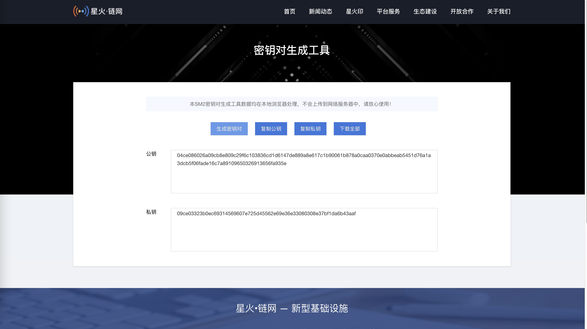
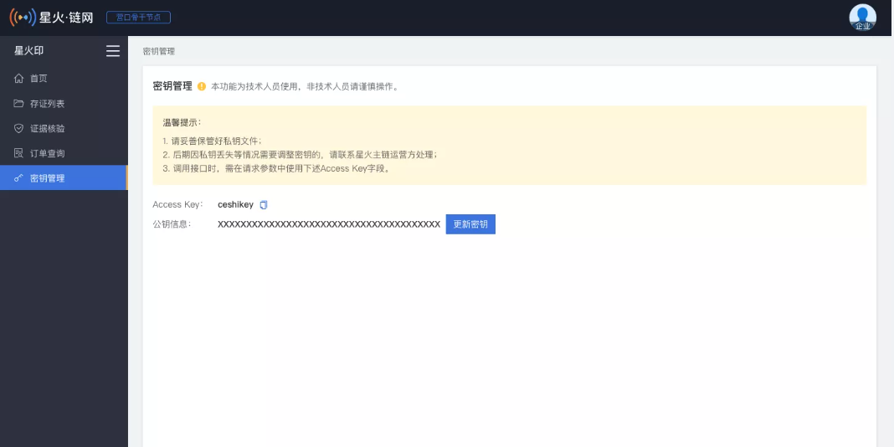

流程
=================

**第一步：登录星火印（网页地址）。**

绑定手机号后请联系客服或者商务申请开通API服务

**第二步：进入星火印（网页地址） 密钥管理，新建秘钥。**

.. image:: image/key_2.png

**第三步：点击进入密匙对生成工具。**

**第四步：点击生成密匙对。**

**第五步：上传SM2公钥，上传成功后的结果如下：**

.. note:: 请保管好自己的私钥。

假定待签名数据头为::

    "request_id": "2XiTgZ2oVrBgGqKQ1ruCKh",
    "access_key": "2y7cg8kmoGDrDBXJLaizoD",
    "nonce": 1464594744

签名过程用Java代码描述如下::

        // RSA私钥文件路径
        String privateKey = "6d1797a808bbb6c65bcd3339b53c6d6a41c7018f773558896b38c7830ff438f7";

        // 请求头
        String requestId = "2XiTgZ2oVrBgGqKQ1ruCKh";
        String accessKey = "2y7cg8kmoGDrDBXJLaizoD";
        long nonce = 1464594744L;
        //待签名数据 = requestId+accessKey+nonce
        String data = requestId + accessKey + nonce;
        // 开始签名
        SM2 sm2 = new SM2(privateKey,null);
        sm2.setMode(SM2Engine.Mode.C1C2C3);
        sm2.usePlainEncoding();
        // 签名使用Base64编码后得到的值即为请求头中signature字段的值
        String signatureData = Base64.getEncoder().encodeToString(sm2.sign(data.getBytes(StandardCharsets.UTF_8)));

.. note:: 签名所用的方法是SM2，签名数据字符串转换成bytes时要用UTF-8编码格式

**第六步：开始接口开发：**

