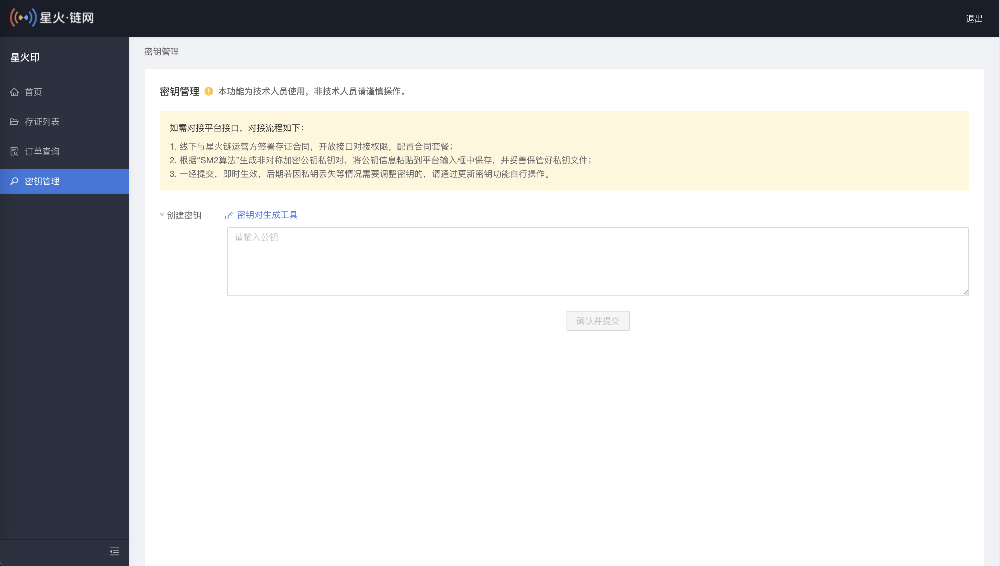

流程
=================

**第一步：登录星火链网（网页地址）。**

绑定手机号后请联系客服或者商务申请开通API服务

**第二步：进入星火链网（网页地址） 密钥管理，新建秘钥。**

**第三步：上传RSA公钥，上传成功后的结果如下：**

.. image:: image/key_3.png

可以参考如下shell命令制作自己的rsa公钥和私钥，openssl版本要求>=1.0.2::

	openssl genrsa -out rsa_private.key 1024
	openssl rsa -in rsa_private.key -pubout -out rsa_public.key

将rsa_public.key中的内容粘贴到文本框中。

.. note:: 请保管好自己的私钥。

假定待签名数据头为::

    "request_id": "2XiTgZ2oVrBgGqKQ1ruCKh",
    "access_key": "2y7cg8kmoGDrDBXJLaizoD",
    "nonce": 1464594744

签名过程用Java代码描述如下::

    // RSA私钥文件路径
    String keyFile = "/tmp/rsa_key.pem";

    // 请求头
    String requestId = "2XiTgZ2oVrBgGqKQ1ruCKh";
    String accessKey = "2y7cg8kmoGDrDBXJLaizoD";
    long nonce = 1464594744L;

    // API path

    String apiName = "evidence/detail";

    //待签名数据 = requestId+accessKey+nonce
    String data = requestId + accessKey + nonce;
    // 开始签名
    PrivateKey privateKey = RsaKeyFactory.getPrivateKey(new InputStreamReader(new FileInputStream(keyFile)));
    Signature signature = Signature.getInstance("SHA256WithRSA");
    signature.initSign(privateKey);
    signature.update(data.getBytes(StandardCharsets.UTF_8));
    // 签名使用Base64编码后得到的值即为请求头中signature字段的值
    String signatureData = Base64.getEncoder().encodeToString( signature.sign());

.. note:: 签名所用的方法是SHA256WithRSA，签名数据字符串转换成bytes时要用UTF-8编码格式

**第四步：开始接口开发：**

